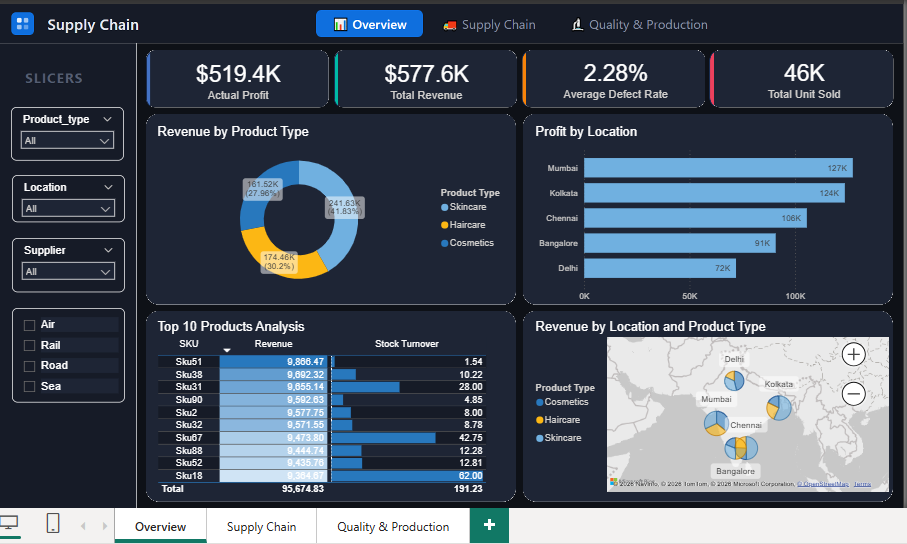

# DEPI-Team2-Supply-Chain-DataAnalysis
# Supply Chain Data Analysis & Optimization Project

## Project Overview
This project focuses on analyzing a comprehensive Supply Chain dataset to identify inefficiencies, optimize costs, and enhance overall profitability for a cosmetics and skincare business. As part of the **Digital Egypt Pioneers Initiative (DEPI)**, this analysis provides actionable insights into logistics, supplier performance, and inventory management.

## Project Objectives
- **Revenue Optimization:** Identify top-performing product categories and sales trends.
- **Logistics Efficiency:** Evaluate shipping carriers and transportation modes based on cost and speed.
- **Quality Control:** Monitor supplier reliability through defect rates and lead times.
- **Data-Driven Decisions:** Provide a modern dashboard for stakeholders to track real-time KPIs.

## Tech Stack
- **Language:** Python 3.x
- **Libraries:** Pandas (Data Cleaning), Matplotlib/Seaborn (Visualization), NumPy
- **Analysis Tools:**  Excel, Power BI
- **Version Control:** GitHub

##  Dashboard Strategy (UI/UX)
Our dashboard follows a **modern, minimalist SaaS-app style** with the following features:
- **App-like Experience:** Clean navigation and intuitive grouping of metrics.
- **Interactive Interactivity:** Dynamic **Slicers** for *Product Type, Location, Carrier, and Supplier*.
- **Three Core Views:**
  1. **Executive Overview:** High-level KPIs (Total Revenue, Profit Margin).
  2. **Logistics Deep-Dive:** Shipping cost analysis and route efficiency.
  3. **Quality & Production:** Supplier defect rates and manufacturing performance.

## Project Structure
- `Data/`: Contains the raw `supply_chain_data.csv`. the Claened Data file and Data Dictionary
- `Documentation/`: Project documentation.
- `Dashboard/`: Dashboard pbix file
- `Presentation/`: Final report PDF and pptx
- `Media/`: FScreenshots of the dashboard and demo

##  How to Run
1. Clone the repository: `git clone https://github.com/nehalshark/DEPI-Team2-Supply-Chain-DataAnalysis.git`
2. Install dependencies: `pip install pandas matplotlib seaborn`
3. Open the notebooks in Jupyter or VS Code to view the analysis.
**Team:** DEPI Team 2  

  

### 🎥 Project Video Demonstration
Check out the interactive features of the dashboard in this video:

https://github.com/nehalshark/DEPI-Team2-Supply-Chain-DataAnalysis/raw/main/Media/Supply_Chain_Demo.mp4
